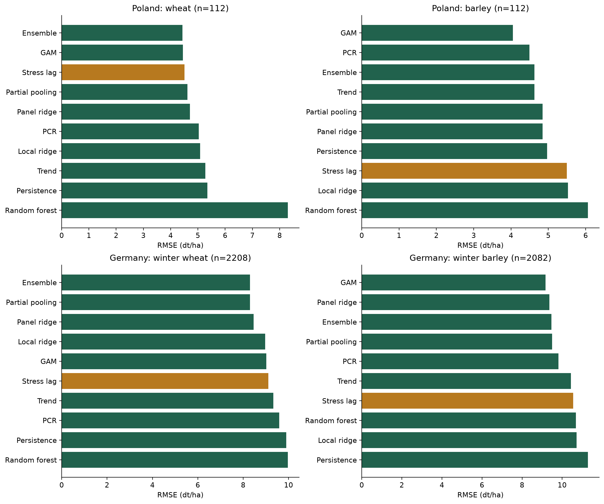
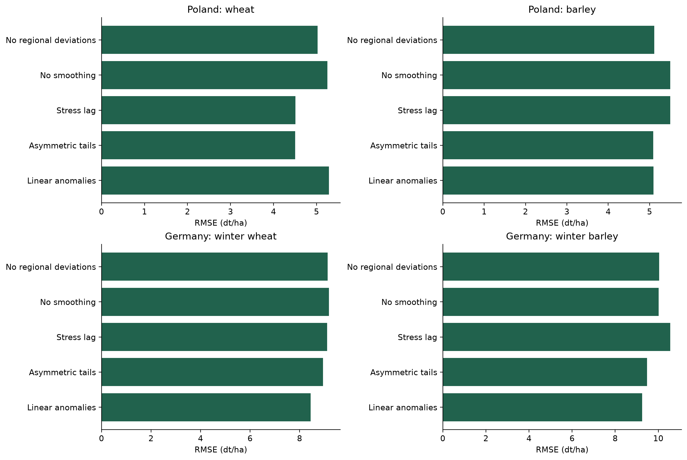
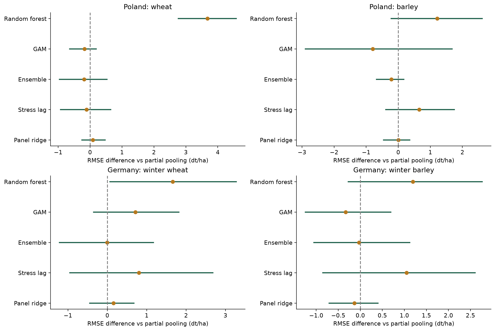
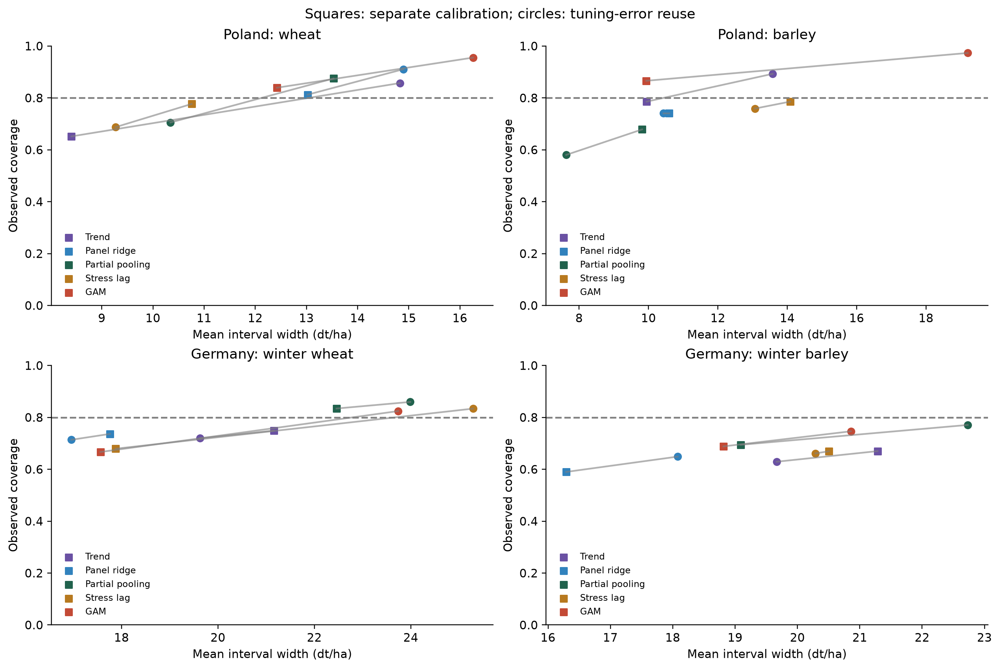
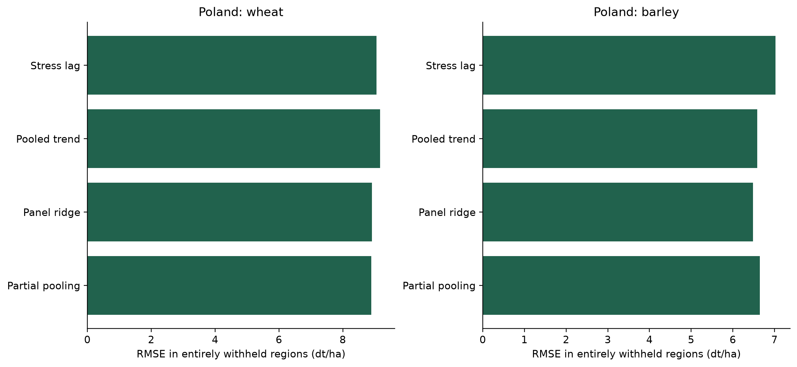
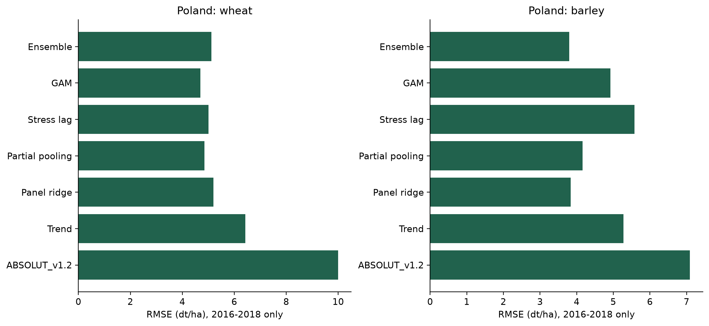

# YieldLag: a reproducible framework for regional climate-yield modelling with seasonal nonlinear responses and chronological evaluation

Research manuscript draft | YieldLag 0.3.0 | 2 October 2026

Mohammad Reza Eini | mohammad_eini@sggw.edu.pl

## Abstract

Regional climate-yield studies require reproducible temporal evaluation, explicit seasonal inputs and defensible uncertainty assessment. YieldLag is an R framework combining linear and partially pooled models with a regularized asymmetric weather-anomaly basis, optional compound hot-dry terms, chronological comparison, prediction decomposition and training-support diagnostics. We evaluate common monthly temperature and precipitation inputs in Polish provincial wheat and barley panels and an external German district archive, using separate tuning, calibration and evaluation periods. External additive-model and random-forest comparators, controlled ablations, complete-region holdouts and a chronological upstream ABSOLUT comparison characterize performance and limitations. Results vary across crops and models; nonlinear complexity does not consistently improve prediction. Year-block uncertainty and weak spatial performance limit claims of general superiority and transferability. The contribution is an auditable research workflow and its comparative evaluation, rather than a new physiological crop model or a universally superior predictor.

## 1. Introduction

Statistical climate-yield models connect regional crop production with weather variability, but comparisons are vulnerable to inconsistent seasons, temporal leakage, unequal selection procedures and ambiguous national aggregation. Established nonlinear weather-response and distributed-lag approaches motivate flexible seasonal representations (Schlenker and Roberts, 2009; Gasparrini et al., 2010). ABSOLUT provides automated selection of time-aggregated weather predictors for regional multiple regression (Conradt, 2022). A previous Polish study evaluated sequential hybridization of ABSOLUT with drought indicators (Eini et al., 2026). The present work addresses a distinct software and evaluation question: how can alternative regional statistical models be specified, compared and interpreted through one reproducible interface, and when do asymmetric seasonal terms add predictive value?

## 1.1. Contribution and relationship to existing software

YieldLag supplies a manifest linking monthly predictors to calendar months and agricultural positions, common fitting/prediction objects, rolling-origin model comparison, separate calibration, exact additive stress-model decomposition, marginal weather-support flags and paired year-block RMSE intervals. The stress basis combines established operations: regional climatology, standardized anomalies, upper/lower hinges, optional same-month temperature-tail and precipitation-deficit products, ridge penalties and second-difference seasonal smoothing. No individual operation is claimed as newly invented. General tools such as mgcv, glmnet, dlnm and modelling-workflow packages can implement related analyses; YieldLag's proposed value is their crop-panel-specific coordination and auditable outputs. This claim requires external-user evaluation and an explicit software comparison, rather than an assertion that existing packages cannot perform these tasks.

## 2. Data and experimental design

The Polish inputs contain monthly weather for 1990-2019 and provincial yields for 1999-2019 across 16 voivodeships. The German external archive (Conradt, 2021; DOI 10.5281/zenodo.4468691) contains district-level monthly weather and annual yields. German regions are eligible when at least five finite initial-period yields and matching weather are available; all eligible regions are included. Yield units are dt/ha. Primary experiments use 12 monthly maximum-temperature and precipitation values each. Polish wheat and barley end their agricultural seasons in July and June, respectively; German winter wheat and winter barley use those same endpoints as declared modelling assumptions. Crop definitions differ, so cases are analyzed separately and no pooled country-transfer result is claimed.

## 2.1. Temporal separation

Initial history is 1999-2004, tuning 2005-2008, interval calibration 2009-2011 and evaluation 2012-2018. Every origin fits coefficients and preprocessing using years strictly earlier than the predicted year. Hyperparameters remain fixed after tuning. Earlier evaluation responses may enter later-origin fits, as in sequential retrospective hindcasting. The year 2019 is excluded from primary fitting/selection and scored separately with the previously selected settings. It already existed in the source archives and is not newly collected confirmatory data. The Polish benchmark informed development; prior team exposure to the German archive is unconfirmed. Full harvest-year weather is supplied, so results do not establish operational early-season forecast skill.

## 2.2. Models and seasonal basis

Comparators are regional trend, persistence, panel ridge, local ridge, principal-component regression, hierarchical partial pooling, stress-lag and a regularized simplex ensemble. For weather variable v and seasonal month m, the stress model estimates a training-region mean and a pooled within-region standard deviation. The standardized anomaly z enters linearly, with upper hinge max(z-tau,0), lower hinge max(-z-tau,0), and an optional product of upper temperature and lower precipitation hinges. Expanded predictors are centered/scaled using training data. Ridge and second-difference penalties control size and seasonal roughness; regional intercept/trend deviations and residual AR correction may be included. The primary threshold is tau=0.75 standardized units, not a physiological damage threshold. Coefficients are unconstrained in sign. Monthly inputs cannot reconstruct daily heat exposure or phenological timing.

## 2.3. Selection and external comparators

Panel/local ridge and stress models each use 12 lambda/smoothing candidates. Hierarchical fitting uses 12 global-penalty, regional/global-ratio and smoothing combinations; PCR uses five component counts. The external mgcv GAM includes six smooths of temperature/precipitation means in three four-month seasonal windows, region intercepts and region trends, with three gamma candidates. Germany uses the bam discrete fREML solver with the same formula; Poland uses gam REML. The random forest uses 500 ranger trees with nine mtry/node-size combinations and seed 2718. Gaussian fits are primary; robust fitting is a Polish sensitivity. External GAM/forest fits have no residual AR correction; package AR-off results are therefore also reported. Unequal candidate counts and feature representations mean that the comparison follows a common temporal protocol, rather than equal computational cost. Ensemble base hyperparameters and stacking shrinkage reuse tuning data; meta-selection is not fully nested, although calibration/evaluation are excluded.

## 2.4. Ablations, sensitivities and spatial tests

Separately tuned stress ablations include linear anomalies, added asymmetric tails, added compound interaction, no seasonal smoothing and no regional deviations. Prespecified sensitivities consider thresholds 0.5, 1 and 1.5, robust fitting, full seven-variable Polish inputs and six-month seasons. No-AR results condition on the original tuning-selected parameters and are not retuned. Four deterministic Polish region folds remove complete held regions from both tuning and every training origin. Only methods supporting unseen-region prediction are included, with a pooled time-trend baseline. This is a test of zero local yield history, distinct from prediction in previously observed regions.

## 2.5. Metrics and uncertainty

Report RMSE, MAE, bias, predictive R2, trend-relative squared-error skill and within-region-centered descriptive R2. The latter removes evaluation-period regional means from the denominator and is a descriptive diagnostic, not an independently fitted detrending procedure. Paired RMSE differences use 2000 circular year-block bootstrap resamples, block length two, 95% percentile limits and seed 2718, retaining all regions within each sampled year. Block lengths one and three provide sensitivities. Only seven annual blocks underlie primary comparisons. Nominal 80% empirical bands use the type-8 quantile of separate calibration absolute errors. Compare coverage, width and interval score against tuning-error calibration on identical prediction means. Three calibration years and temporal/spatial dependence provide no distribution-free coverage guarantee.

## 2.6. Upstream ABSOLUT comparison

A supplementary 2016-2018 Polish comparison runs upstream ABSOLUT v1.2, retaining its documented minimum of 17 yield years, nbest=23 and maximum 42 preselected features. Principal variables are temperature and precipitation; bestof is declared as 10. Each origin truncates all response inputs before that year. Portable changes replace MPI with sequential foreach, omit shell cleanup/printf in fresh isolated folders, preserve single-column data frames and compute only the requested forecast-origin target. The upstream fitting and selection operations are retained. Original GPL code is downloaded and run separately from the MIT R package, with checksums and adapter manifests. The shorter native comparison cannot support the same seven-year inference as the primary experiment.

## 3. Results

Across the 4514 evaluation region-years, the stress model's RMSE was 4.508 for Polish wheat, 5.497 for Polish barley, 9.108 for German winter wheat and 10.549 for German winter barley. Corresponding partial-pooling RMSEs were 4.620, 4.843, 8.304 and 9.498 dt/ha. The stress model improved the point estimate only for Polish wheat, and every paired stress-versus-pooling interval included zero. The GAM achieved RMSEs of 4.448, 4.048, 9.016 and 9.165 dt/ha. Linear anomalies alone improved the German stress-family point estimates, whereas Polish wheat benefited from asymmetric tails; adding the compound interaction did not establish a consistent additional gain. These descriptive differences support crop-specific selection rather than a universal nonlinear advantage. Table 1 reports the primary common-input comparison; Figure 1 includes all primary estimators. These experiments have different inputs, fitting assumptions and tuning/calibration periods from the previously published v0.2.0 Polish reference explorer and must not be mixed with its performance numbers. Table 2 and Figure 3 show paired uncertainty relative to partial pooling. Performance should be interpreted case by case: a lower point RMSE is not evidence of a universal improvement, particularly when its interval includes zero. The separately tuned ablations in Figure 2 identify where additional terms help or hurt; they cannot by themselves establish a causal response to heat or water deficit.

Table 1. Primary evaluation RMSE (dt/ha), 2012-2018.

| Case | Regions | N | Panel ridge | Partial pooling | Stress lag | GAM | Forest |
|---|---|---|---|---|---|---|---|
| Poland: wheat | 16 | 112 | 4.708 | 4.620 | 4.508 | 4.448 | 8.298 |
| Poland: barley | 16 | 112 | 4.849 | 4.843 | 5.497 | 4.048 | 6.059 |
| Germany: winter wheat | 351 | 2208 | 8.463 | 8.304 | 9.108 | 9.016 | 9.965 |
| Germany: winter barley | 337 | 2082 | 9.362 | 9.498 | 10.549 | 9.165 | 10.690 |

Table 2. Paired stress-lag minus partial-pooling RMSE differences.

| Case | Difference | 95% interval |
|---|---|---|
| Poland: wheat | -0.112 | [-0.923, 0.649] |
| Poland: barley | 0.653 | [-0.388, 1.749] |
| Germany: winter wheat | 0.804 | [-0.953, 2.681] |
| Germany: winter barley | 1.052 | [-0.850, 2.608] |

## 3.1. Calibration, spatial support and sensitivity

Separate calibration removes direct reuse of model-selection errors, but it does not necessarily improve observed coverage. Figure 4 reports both calibration procedures, including undercoverage. Coverage must be interpreted together with interval width and score. Figure 5 shows weak prediction in entirely withheld Polish provinces: local yield levels/history contribute materially to performance in known regions. Full-weather, shortened-season, robustness, threshold and AR-off sensitivity tables accompany the analysis. Large threshold sensitivity argues against interpreting a chosen anomaly hinge as a measured crop damage threshold. The supplementary native comparison in Figure 6 uses only 48 province-year observations per crop; uncertainty from three annual blocks is necessarily weak.

## 4. Discussion

The evidence supports YieldLag as a transparent framework for comparative regional statistical modelling. It does not establish a universally superior stress estimator, a mechanistic crop model or reliable prediction without local yield history. Negative results and instability are useful guidance for users: nonlinear terms should earn their complexity against partial pooling and external additive baselines. Exact decomposition verifies the fitted equation, but components are centered statistical associations rather than causal losses; correlated climate variables and regularization further limit coefficient interpretation. Marginal training-range flags do not certify multivariate support or calibrated confidence.

## 4.1. Limitations and next validation

The study combines two countries but not harmonized identical crop definitions, and German district scale differs from Polish provincial scale. The public external archive is an additional benchmark, not an assured untouched country test. A future confirmatory study should freeze methods before obtaining genuinely uninspected later observations, harmonize crop definitions and spatial support, and use forecasts available at the stated issue date. Polish fixed-area weights and source solar derivation remain incompletely documented; therefore primary comparative inference uses region-year errors and the two weather variables with clearer working conventions. National weighted references are not independent observations. External adoption and independent human reproduction remain necessary to assess practical software reuse.

## 5. Availability and reproducibility

Software: https://github.com/MR-Eini/yieldlag, version 0.3.0, MIT code. Website: https://mr-eini.github.io/yieldlag/. Scripts, temporal protocol, candidate grids, selected parameters, row-level predictions, session information, paired bootstrap tables, native adapter manifests and downloadable figures accompany this draft. The original v0.2.0 source is frozen by commit/hash. German downloads are checksum verified and retain CC-BY-4.0 archive metadata plus the agricultural tables' Data licence Germany attribution terms. Poland derivatives retain the provider/source processing notice separately from the code license. A Zenodo record and DOI require authenticated archival completion; this draft does not claim one has been issued.

## Author and AI-use declarations

Mohammad Reza Eini is the current software maintainer and proposed manuscript author. Final contributors, affiliations, funding and conflict declarations require author confirmation. OpenAI Codex assisted with code development, tests, analysis scripts, documentation, plots and manuscript drafting. Exact deployed model/version and the scope of human review must be confirmed before submission. Automated tests and recomputation are documented; they do not substitute for author scientific review or an independent researcher's reproduction. No completed human review, external adoption or journal submission is asserted in this draft.

## References

Conradt, T. (2022). Choosing multiple linear regressions for weather-based crop yield prediction with ABSOLUT v1.2 applied to the districts of Germany. International Journal of Biometeorology, 66, 2287-2300. https://doi.org/10.1007/s00484-022-02356-5

Conradt, T. (2021). German ABSOLUT input archive. https://doi.org/10.5281/zenodo.4468691. ABSOLUT v1.2 software: https://doi.org/10.5281/zenodo.5789350.

Eini, M. R., Conradt, T., and Piniewski, M. (2026). Sequential hybridization enhances the reliability of a statistical crop yield model - exemplified by wheat and sugar beet yields in the provinces of Poland. Theoretical and Applied Climatology. https://doi.org/10.1007/s00704-026-06322-8

Schlenker, W., and Roberts, M. J. (2009). Nonlinear temperature effects indicate severe damages to U.S. crop yields under climate change. PNAS. https://doi.org/10.1073/pnas.0906865106

Gasparrini, A., Armstrong, B., and Kenward, M. G. (2010). Distributed lag non-linear models. Statistics in Medicine. https://doi.org/10.1002/sim.3940

Wood, S. N. (2011). Fast stable restricted maximum likelihood and marginal likelihood estimation of semiparametric generalized linear models. JRSS B. https://doi.org/10.1111/j.1467-9868.2010.00749.x

Wright, M. N., and Ziegler, A. (2017). ranger: A fast implementation of random forests for high dimensional data in C++ and R. Journal of Statistical Software. https://doi.org/10.18637/jss.v077.i01

## Figures

Figure 1. All primary model RMSEs under the common chronological protocol. Cases differ in crop definition and spatial scale.

Figure 2. Separately tuned seasonal-basis ablations on identical test observations. Extra complexity may increase error.

Figure 3. Paired RMSE differences and 95% circular year-block bootstrap intervals relative to partial pooling. Seven annual blocks limit inference.

Figure 4. Nominal 80% interval coverage versus width. Separate calibration excludes model-selection errors but does not guarantee coverage.

Figure 5. Complete-region holdouts in Poland. All held-region responses are excluded from tuning and training.

Figure 6. Upstream ABSOLUT comparison with chronological response truncation, 2016-2018. Only three annual blocks contribute.

